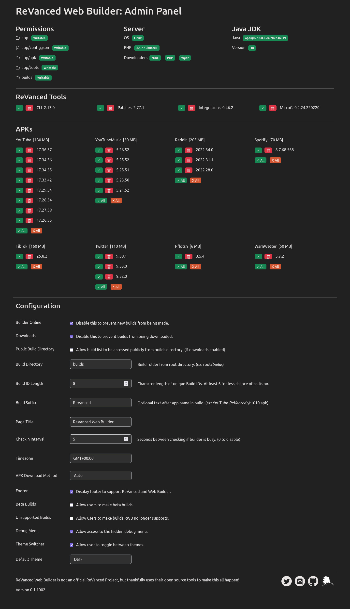

# ReVanced Web Builder

HTML/JS frontend and PHP backend for the official ReVanced CLI builder.

ReVanced Web Builder is a tool that injects patches into the official Android Apps (APKs) of apps like YouTube, YouTube Music, Spotify, TikTok, Twitter, and Reddit to block advertisements, customize theme, and bring many additional features to the apps.

The ReVanced CLI is a powerful tool that lets you modify many apps with different patches and options. However, not everyone has the tools or experience to use the command line tool.

ReVanced Web Builder is an entire interface (with an admin panel) that allows you to customize and build all apps supported by ReVanced. Builds can be stored on your server and users can download them after building.

Admin chooses which apps and versions to allow users to build, along with other options to customize the script.

Note: Hosting and distributing patched APKs can be a legal issue. Be cautious about who has access to ReVanced Web Builder.
It's best to just use this for personal use, but I'm not responsible for what you do with this code or project on your own server.

## Requirements

- Apache Web Server (Windows, Mac, or Linux)
- Java JDK >= 17
- PHP >= 7.4
- cURL (System or PHP) or wGet

## Installation

If you already have Apache, PHP, and Java set up:

1. Extract the release to anywhere in your web server.
2. (Linux/Mac only) Give write permissions to the "builds" and "app" folder.
3. Point your web browser to the RWB folder (example: http://localhost/rwb)

### Fresh Install (Linux, Ubuntu 22.04 and 22.10)

This is a quick way to install Apache, PHP, and Java OpenJDK on a fresh cooy of Ubuntu 22.04 and 22.10.

Please keep in mind this isn't the best or most secure way to do things, but should be easy enough for beginners.

Install Apache 2 Web Server

`sudo apt install -y apache2 apache2-utils`

Install PHP (8.1) with cURL and wGet

`sudo apt install -y php libapache2-mod-php php-curl curl wget`

Enable mod_rewrite (Optional)

`sudo a2enmod rewrite`

Give htdocs/html folder proper privileges

`sudo usermod -a -G www-data $USER`

`sudo chown root:root /var/www`

`sudo chmod -R 755 /var/www`

`sudo chown -R www-data:www-data /var/www/*`

Install Java OpenJDK 18

`sudo apt install opendjk-18-jdk-headless openjdk-18-jdk`

Place ReVanced Web Builder in `/var/www/html/` (such as `/var/www/html/rwb`)

Give write permissions to two folders

`sudo chmod 0777 /var/www/html/rwb/app`

`sudo chmod 0777 /var/www/html/rwb/builds`

Restart Apache

`sudo systemctl restart apache2`

Direct your web browser to http://localhost/rwb

## Screenshots

Home Screen

Admin Panel

